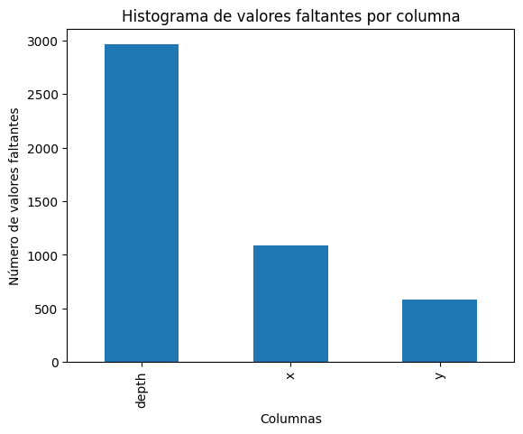

# Diamonds
Data analysis about diamonds dataset

## Descripcion del problema. 

Realizar un modelo de regresion sobre el precio de los diamnates en base a las caractersiticas registradas en los archivos .csv proporcionados en el correo. Este 
archivo csv contiene 53,930  registros con 10 caracteristicas cada uno, las cuales son:

|  Variable | Total not null values | type    |
|-----------|-----------------------|---------|
| carat     |   53930 non-null      | float64 |
|  cut      |   53930 non-null      | object  |
|  color    |   53930 non-null      | object  |
|  clarity  |   53930 non-null      | object  |
|  depth    |   50968 non-null      | float64 |
|  table    |   53930 non-null      | float64 |
|  price    |   53930 non-null      | int64   |
|  x        |   52840 non-null      | float64 |
|  y        |   53345 non-null      | float64 |
|  z        |   53930 non-null      | float64 |

Aqui notamos que las unicas variables que presentan valores nulos son *depth, y* y *y*. 
. 

En una investigacion en sitios donde se almacen o proporcionan bases de datos abiertas se encontro tabla de condiciones similares en [Kaagle](https://www.kaggle.com/datasets/shivam2503/diamonds), en lo anterior se obtiene la siguiente informacion adicional sobre el comportamiento de la tabla en las variables que nos interesan en este momento.

|Variable | descripcion |
|---------|----------------------|
|y        |width in mm (0--58.9) |
|z        |depth in mm (0--31.8) |
|depth    |total depth percentage = $\frac{z}{mean(x, y)}$ |

Antes de adentrarnos sin dudar de que la informacion sea correcta, comprovaremos esto con aquellas variables de las cuales si tenemos todos los valores. 

```
depth_prop = round(df_clean["z"] / df_clean.loc[:, ['x', 'y']].mean(axis=1)*100, 1)
df_clean["depth_prop"] = depth_prop
(df_clean["depth"] != df_clean["depth_prop"]).sum()
df_clean.shape[0] - (df_clean["depth"] != df_clean["depth_prop"]).sum()
```

Obtenemos que el 92.95% de los valores corresponden de manera identica al valor de la formula $\frac{z}{mean(x, y)}$, mientras que el 7.05% restante se distribuye de la siguiente forma:
|Diferencia absoluta en el intervalo | Cantidad | Porcentaje|
|------------------------------------|----------|-----------|
|$[0,0]$         | 47378 | 92.95   | 
|$(0,1)$         | 3480  | 6.82    |
|$[1,10)$        | 59    | 0.11    |
|$[11,100)$      | 30    | 0.05    | 
|$[100,10000)$   | 5     | 0.009   |
 **Total**       | 
Es decir, el 99.19% de los valores en $deepth$ se pueden encontrar atravez de la formula $\frac{z}{mean(x, y)} + \varepsilon$, donde $\varepsilon$ es ruido blanco con una distribución $N(0,1)

P.D. Esta es una observacion, para ser completamente efectivos es necesario una prueba de hipotesis. Sin embargo estos errores donde la diferencia es mayor de 1 podria ser mas explicados con el error humano.

### Inputacion
De los 2,962 registros faltantes, se sabe que estos faltantes unicamente se encuentran en 3 columnas. *x,y, depth*.  Partimos esto en los 7 casos posibles, en la siguiente columna se muestran esos casos, donde el "Si" o "No" son a la pregunta sobre si esa columna tiene un valor conocido.

|Caso|x |y |depth | Cantidad | % ||
|--|--|--|---|----|---|-|
|I|Si|Si|No |1872|63.20| 
|II|Si|No|Si |  0 | 0   | 
|III|No|Si|Si |  0 | 0   | 
|IV|No|No|Si |  0 | 0   | 
|V|No|Si|No |505 |17.05| 
|VI|Si|No|No |  0 | 0   |  
|VII|No|No|No |585 |19.75| 
||  |  |   |2962|100|**Total**

Notamos que los datos se distribuyen unicamente en 3 casos:
* Caso I: Unicamente se desconoce *depth*: En este caso y como ya hemos probado, la formula $depth =\frac{z}{mean(x, y)}$. Podemos hacer una imputación directa a travez de evaluar la formula con los valore sconocidos. Esto nos permite recuperar el 63.2% de los datos faltantes.
* Cao IV: Aqui se desconoce el valor de *x* y *depth*. Por la formula sabemos que *depth se pued calcular, entonces solo es necesario imputar el valor de $x$. Para esto aplicaremos la siguiente imputacion:
    **imputacion por la media de los 15-vecinos mas cercanos**.


## EDA 

Comenzamos analizando los casi 54 mil registros que componen 
